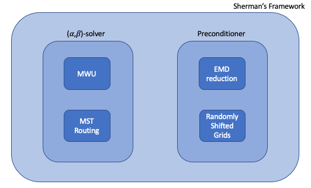

# Andoni et. al Implementation
We split the Andoni et. al implementation into two parts:
* Low hop emulator
* Uncapacitated min-cost flow

## Low hop emulator
Given a graph, we construct a sparser subgraph (w.r.t. vertices) that approximates distances well. The motivating application of low hop emulators is an efficient parallel algorithm for Bourgain's embedding, which we will utilize in solving uncapacitated min-cost flow.

## Uncapacitated min-cost flow
We solve uncapacitated min-cost flow within Sherman's framework. Sherman's framework gives us provable approximation/convergence for iterative methods.

### Solvers
We design two solvers, with different approximation guarantees: 
* Multiplicative weights update
* Minimum spanning tree routing

### Preconditioner
We design a preconditioner: 
* Reduce uncapacitated min-cost flow to Earth mover's distance (EMD) via Bourgain's embedding.
* Solve EMD approximately via randomly shifted grids.

We also compress the representation of our preconditioner.

## References
* [Parallel Approximate Undirected Shortest Paths via Low Hop Emulators](https://arxiv.org/pdf/1911.01956.pdf)
* [Caleb/Tim's slides](https://github.com/timjbaer/laplacian_preconditioners/blob/master/docs/notes/Low_Hop_Emulators_and_Applications_full.pdf)
